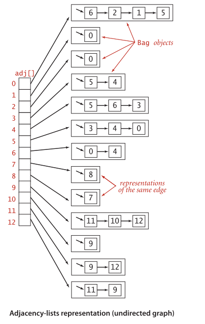

## 概述
图是一种对结点和连接抽象的数学模型.本章学习4种最重要的图模型:
- 无向图(简单连接)
- 有向图(连接有方向)
- 加权图(连接带有权值)
- 加权有向图(连接既有方向性又带有权值)
---
## 4.1 无向图
> 定义: 图是由一组顶点(vertex)和一组能够将两个顶点相连的边(edge)组成的.

特殊的图:
- 自环: 即一条连接一个顶点和其自身的边.
- 平行边: 连接同一对顶点的两条边.

数学家常常将含有平行边的图称为*多重图*, 而将没有平行边或自环的图称为*简单图*.
  ### 4.1.1 术语表
  - 顶点相邻: 两个顶点通过一条边相连
  - 依附: 连接依附于其两个顶点.
  - 顶点的度数: 依附于顶点的边的总数.
  - 子图: 一幅图的子集
  > **路径**是由边顺序连接的一系列顶点.
  > **简单路径**是一条没有重复顶点的路径
  > **环**是一条至少含有一条边且起点和终点相同的路径.
  > **简单环**是一条(除了起点和终点必须相同之外)不含有重复顶点和边的环.
  > **路径或者环的长度**为其中所包含的边数.
  - 连通: 两个顶点存在一条路径时.
  > **连通图:** 从任意一个顶点都存在一条路径到达另一个任意顶点.
  > **非连通图:** 由若干连通的部分组成,它们都是其极大连通子图.
  - 无环图: 不包含环的图
  > **树**是一幅无环连通图.
  > **森林:**互不相连的树组成的集合.
  > **生成树:** 是连通图的一幅子图,它含有图中的所有顶点且是一棵树.
  > **生成树森林:** 是它的所有连通子图的生成树的集合.

  **满足下列任意一个条件的V个结点图G即为树:**
  1. G有V-1条边且不含有环;
  2. G有V-1条边且是连通的; 
  3. G是连通的, 但删除任意一条边都会使它不再连通;
  4. G是无环图, 但添加任意一条边都会产生一条环;
  5. G中任意一对顶点之间仅存在一条简单路径.

  **图的密度**是指已经连接的顶点对占所有可能被连接的顶点为对的比例.
  **二分图**是一种能够将所有结点分为两部分的图,其中图的每条边所连接的两个顶点都分别属于不同的部分.

  ### 4.1.2 表示无向图的数据类型
  **图的基本操作API**

|            public class | Graph                       | 功能                              |
| ----------------------: | --------------------------- | --------------------------------- |
|                         | ```Graph(int V)```          | 创建一个含有V个顶点但不含有边的图 |
|                         | ```Graph(In in)```          | 从标准输入流 in 读入一幅图        |
|               ```int``` | ```V()```                   | 顶点数                            |
|               ```int``` | ```E()```                   | 边数                              |
|              ```void``` | ```addEdge(int v, int w)``` | 向图中添加一条边 v-w              |
| ```Iterable<Integer>``` | ```adj(int v)```            | 和v相邻的所有顶点                 |
|            ```String``` | ```toString()```            | 对象的字符串表示                  |

#### 1. 图的几种表示方法

图的数据结构使用*邻接表数组* : 以顶点为索引的列表数组, 其中每个元素都是和该顶点相邻的顶点列表.




#### 2. 邻接表的数据结构

*非稠密图的标准表称为邻接表.*

用数组表示顶点列表. 用Bag实现邻接点链表.

此实现的性能有如下特点:

- 使用的空间和V+E成正比.
- 添加一条边所需的时间为常数
- 遍历顶点v的所有相邻顶点所需的时间和v的度数成正比(处理每个相邻顶点所需的时间为常数)


#### 3. 图的处理算法的设计模式


